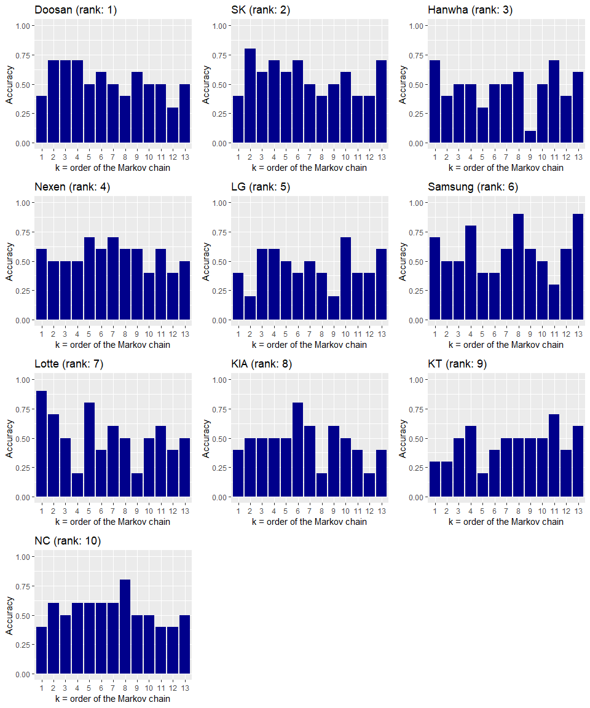

# 1. Introduction & Dataset Load

The dataset comes from https://mykbostats.com/teams. It contains, for each of the 10 teams (Doosan Bears, SK Wyverns, Hanwha Eagles, Nexen Heroes, LG Twins, Samsung Lions, Lotte Giants, KIA Tigers, KT Wiz, and NC Dinos) in the Korea Baseball Organization league (a.k.a "KBO league"), the result in the recent 100 games (where the result can be one of "win", "loss", and "draw"). Unlike in the Major League Baseball (a.k.a "MLB") where the game doesn't end as a draw (or a tie) only due to weather (or sometimes darkenss), in a KBO league game, if the two teams have the same score after the 12th inning, the game ends as a draw.

The data are based on what's on the website in August 18th, 2018, which is right before the Asian Games break. (The KBO league in 2018 has a break of approximately 3 weeks since some of the players go to the Jakarta-Palembang Asian Games 2018 as part of the South Korean national team.)

Let's load the dataset.


```r
library(readxl)
recent100.df = as.data.frame(read_excel("recent100games_data.xlsx"))
```

In this dataframe (100 rows and 10 columns), each of the 10 columns represents each of the 10 teams in the KBO league. For each column, the 100 rows have the results of the recent 100 games of the corresponding team, where the order is that the 100th row shows the outcome in the most recent game. That is: we get the chronological order as we go from the top row to the bottom row. Here, "W" represents win, "L" represents loss, and "D" represents draw.

The first few rows of the dataframe look like:


```r
head(recent100.df)
```

```
##   Doosan SK Hanwha Nexen LG Samsung Lotte KIA KT NC
## 1      W  L      W     W  W       W     W   W  W  L
## 2      W  L      L     L  W       L     L   W  W  L
## 3      L  W      W     L  W       L     W   L  W  L
## 4      W  W      W     L  L       W     W   L  L  W
## 5      L  W      W     W  L       L     L   L  L  W
## 6      W  W      L     W  L       W     W   L  L  L
```

# Fit Higher-Order Markov Chains for Each Team's Sequence

Now, for each team's sequence (of length 100), let's fit higher-order Markov chains, trying several values for the order *k*. Let's try *k* = 1, ... , 13.


```r
require(markovchain)
```

```
## Loading required package: markovchain
```

```
## Package:  markovchain
## Version:  0.6.9.12
## Date:     2018-08-23
## BugReport: http://github.com/spedygiorgio/markovchain/issues
```

```r
library(Rsolnp)

teams = colnames(recent100.df)

# for each team
for (team.index in 1:10) {
  team.name = teams[team.index]
  # for each order k
  for (k in 1:13) {
    variable.name = paste(team.name, k, sep="")
    assign(variable.name, fitHigherOrder(recent100.df[,team.index], order=k))
  }
}
```

The variable names are stored as the team name with order fitted. For example, the variable "Doosan3" is the object of the fitted 3rd order Markov chain on Doosan Bears's sequence (of length 100).


```r
Doosan3
```

```
## $lambda
## [1] 2.670039e-07 1.999981e-07 9.999995e-01
## 
## $Q
## $Q[[1]]
##           L         W
## L 0.3421053 0.4098361
## W 0.6578947 0.5901639
## 
## $Q[[2]]
##           L         W
## L 0.4324324 0.3606557
## W 0.5675676 0.6393443
## 
## $Q[[3]]
##           L         W
## L 0.3783784 0.3833333
## W 0.6216216 0.6166667
## 
## 
## $X
##    L    W 
## 0.38 0.62
```

In the output (according to the pacakge documentation), the 'lambda' shows the estimated $\lambda_{1}$, $\lambda_{2}$, ... , $\lambda_{k}$ parameters (following the notation from the main paper), the 'Q' shows the estimated transition probability matrix for each lag (from 1 to *k*), and lastly the 'X' shows the estimated distribution of the states. 

Note that in the case of the team Doosan Bears, the state "D" didn't appear at all in the sequence (so Doosan didn't have any draw game in the recent 100 games), so the package set the state space of the Markov chain as {W, L} instead of {W, L, D}.

# Checking, For Each Team, Which Order (k) Markov Chain Best Models The Team's Performance

Next, for each of the 10 teams, let's check which value of *k* best models the team's outcomes. Let's do so by this process.

- Randomly choose 10 games out of the 100 games in the sequence.
- For each of the 10 games (say *Xn*), for each of the 3 possible states (say *s*, which should be one of "W", "D","L"), compute the estimated probability that *Xn*=*s* given the *k* previous games' results, using the formula in the paper. Then, draw a categorical random variable with 3 categories (think of it as a Bernoulli trial but with 3 options) using the estimated probabilities and use the outcome state as our prediction.
- Compute the accuracy of the predictions.

Note that the formula of the probability that the current state is state *i* given the recent *k* observations is given in Equation (5) in my paper.


```r
set.seed(42)

# Initialize results dataframe. Each row represents each team, 
# and each column represents each value of the order *k*. 
# Note that the rows are ordered in the current (when I got the data: August 18th, 2018) 
# ranking of the KBO league. e.g. Doosan is in the 1st row since it's in 1st rank in the league, 
# and Nexen is in the 4th row since it's in the 4th rank in the league.
results.df = data.frame("k_1" = rep(0,10), "k_2" = rep(0,10), "k_3" = rep(0,10),
                        "k_4" = rep(0,10), "k_5" = rep(0,10), "k_6" = rep(0,10),
                        "k_7" = rep(0,10), "k_8" = rep(0,10), "k_9" = rep(0,10),
                        "k_10" = rep(0,10), "k_11" = rep(0,10), "k_12" = rep(0,10),
                        "k_13" = rep(0,10))
rownames(results.df) = teams

# for each team
for (team.index in 1:10) {
  team.name = teams[team.index]
  
  # Randomly choose 10 games out of the 100
  # (Note that we choose from game #14 because for games #1 to #13, a 
  # 13th order Markov chain can't work.)
  ten.games = sample(x=14:100, size=10, replace=FALSE)
  
  this.team.accuracy.list = rep(0,13)
  # for each order k
  for (k in 1:13) {
    # get the corresponding fitted Markov chain object (i.e. this team & this k)
    variable.name = paste(team.name, k, sep="")
    fitted.markov.chain = get(variable.name)
    
    num.correct = 0
    num.total = 10
    
    # for each of the 10 games to predict on
    for (game in ten.games) {
      # the true answer
      true.outcome = recent100.df[,team.index][game]
      
      state.space = rownames(fitted.markov.chain$Q[[1]])
      state.probs = rep(0, length(state.space))
      # for each state
      for (j.0 in state.space) {
        # estimate the probability that this state is the outcome
        prob = 0
        # for each lag
        for (i in 1:k) {
          # estimated lambda and Q for this lag
          lambda.i = fitted.markov.chain$lambda[i]
          Q.i = fitted.markov.chain$Q[[i]]
          
          # the observed state in i steps ago
          j.i = recent100.df[,team.index][game-i]
          
          # add the term (follow the formula)
          prob = prob + (lambda.i * Q.i[j.0, j.i])
        }
        state.probs[which(state.space==j.0)] = prob
      }
      # Make prediction (categorical disribution trial)
      require(extraDistr)
      predict = as.character(rcat(n=1, prob=state.probs, labels=state.space))
      
      # Now that we have our final predicted state, check if it's correect
      if (predict == true.outcome) {
        num.correct = num.correct + 1
      }
    }
    # Compute the accuracy for this value of k
    this.k.accuracy = num.correct / num.total
    this.team.accuracy.list[k] = this.k.accuracy
  }

  # Store this team's results in our dataframe
  results.df[team.index,] = this.team.accuracy.list
}
```

```
## Loading required package: extraDistr
```

```r
# Show results
results.df
```

```
##         k_1 k_2 k_3 k_4 k_5 k_6 k_7 k_8 k_9 k_10 k_11 k_12 k_13
## Doosan  0.4 0.7 0.7 0.7 0.5 0.6 0.5 0.4 0.6  0.5  0.5  0.3  0.5
## SK      0.4 0.8 0.6 0.7 0.6 0.7 0.5 0.4 0.5  0.6  0.4  0.4  0.7
## Hanwha  0.7 0.4 0.5 0.5 0.3 0.5 0.5 0.6 0.1  0.5  0.7  0.4  0.6
## Nexen   0.6 0.5 0.5 0.5 0.7 0.6 0.7 0.6 0.6  0.4  0.6  0.4  0.5
## LG      0.4 0.2 0.6 0.6 0.5 0.4 0.5 0.4 0.2  0.7  0.4  0.4  0.6
## Samsung 0.7 0.5 0.5 0.8 0.4 0.4 0.6 0.9 0.6  0.5  0.3  0.6  0.9
## Lotte   0.9 0.7 0.5 0.2 0.8 0.4 0.6 0.5 0.2  0.5  0.6  0.4  0.5
## KIA     0.4 0.5 0.5 0.5 0.5 0.8 0.6 0.2 0.6  0.5  0.4  0.2  0.4
## KT      0.3 0.3 0.5 0.6 0.2 0.4 0.5 0.5 0.5  0.5  0.7  0.4  0.6
## NC      0.4 0.6 0.5 0.6 0.6 0.6 0.6 0.8 0.5  0.5  0.4  0.4  0.5
```


# Any Pattern / Relationship between 'Good' Values of k and the Team's Rank?

Here are the plots for each team that show the accuracy for each value of *k*.


```r
library(ggplot2)

for (team in teams) {
  accuracies = as.numeric(results.df[team,])
  df = data.frame(k.values = names(results.df),
                  accuracies = accuracies)
  # Recall that the 'teams' vector has the team names in the order of 
  # the current KBO league rank
  rank = which(teams==team)
  barplot.name = paste("barplot", team, sep="")
  assign(barplot.name, 
         ggplot(data=df, aes(k.values, accuracies)) + 
           geom_bar(stat="identity", fill="darkblue") +
           labs(title=paste(team, " (rank: ", rank, ")", sep=""),
                x="k = order of the Markov chain",
                y="Accuracy") +
           scale_x_discrete(limits=df$k.values,
                            labels=as.character(1:13)) + 
           scale_y_continuous(limits=c(0,1)))
}

library(gridExtra)
grid.arrange(barplotDoosan, barplotSK, barplotHanwha, barplotNexen, barplotLG,
             barplotSamsung, barplotLotte, barplotKIA, barplotKT, barplotNC,
             nrow=4)
```

<!-- -->

